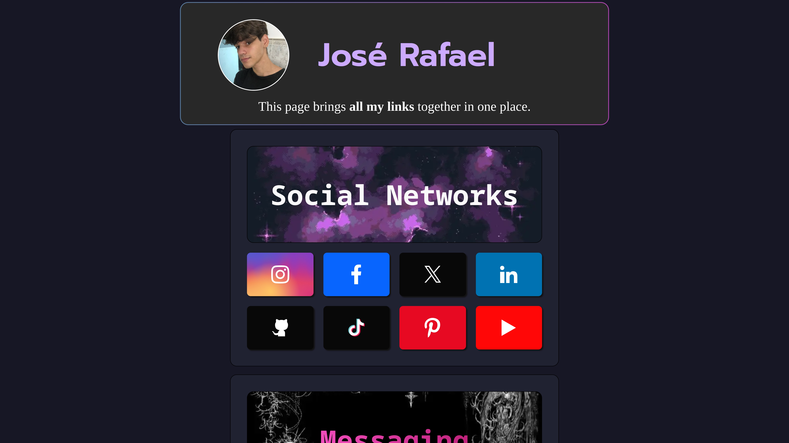
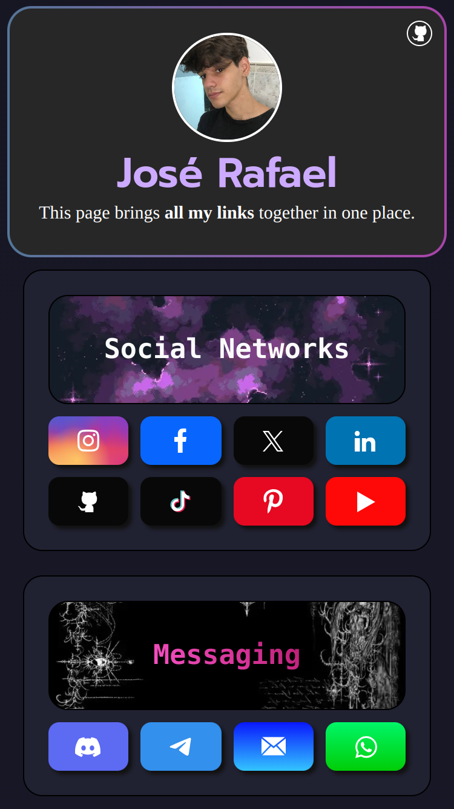

<a id="top"></a>
<h1 align="center">🔗 JRLinks</h1>

 If you want to read this readme in Spanish
- [Spanish](https://github.com/joserafael0160/jrlinks/blob/main/readme.es.md)

<p align="center">
  <a href="#">
    
  </a>
  <a href="https://opensource.org/licenses/MIT" target="_blank">
    
  </a>
</p>

<div align="center">
    <a href="#-About" target="_blank">
        About
    </a>
    <span>&nbsp;✦&nbsp;</span>
    <a href="#-Preview" target="_blank">
        Preview
    </a>
    <span>&nbsp;✦&nbsp;</span>
    <a href="#-Features" target="_blank">
        Features
    </a>
    <span>&nbsp;✦&nbsp;</span>
    <a href="#-Stack" target="_blank">
        Stack
    </a>
    <span>&nbsp;✦&nbsp;</span>
    <a href="#-Getting-started">
        Getting Started
    </a>
    <span>&nbsp;✦&nbsp;</span>
    <a href="#-Commands">
        Commands
    </a>
    <span>&nbsp;✦&nbsp;</span>
    <a href="#-Contributions" target="_blank">
        Contributions
    </a>
    <span>&nbsp;✦&nbsp;</span>
    <a href="#-License">
        License
    </a>
    <span>&nbsp;✦&nbsp;</span>
    <a href="#-Support">
        Support
    </a>
</div>

## 📜 About 
I have created this page with the intention of having all my links in one place. You can find me on all my platforms here. 💜

<p align="right">(<a href="#top" >Go Back To Top 🔝</a>)</p>

## 👀 Preview
<h4>In a PC (1920x1080)</h4> 

<h4>In a iPhone SE (375x667)</h4>


<p align="right">(<a href="#top">Go Back To Top 🔝</a>)</p>


## 💬 Features
- **Links**: Links to various Social Media Platforms, Messaging Platforms and Games/Educational Platforms.
- **Favicon Support**: Support for a wide range of favicon sizes has been added, ensuring that the site’s icon displays correctly on all devices and platforms.
- **Open Graph and Twitter Tags**: Open Graph and Twitter meta tags have been included, which optimize the preview of the website on social platforms like Facebook and Twitter.
- **Responsive Design**: The website has been designed to be responsive, which means it will look good on devices of all sizes.
- **Language Localization**: A script for changing the language has been added, making the site more accessible to users who speak different languages.

<p align="right">(<a href="#top">Go Back To Top 🔝</a>)</p>

  
## 🛠️ Stack
- [**Vite**](https://vitejs.dev/) - It’s a fast and flexible tool for building and testing JavaScript applications.
- [**HTML**](https://developer.mozilla.org/es/docs/Web/HTML) - It’s the standard markup language for web pages.
- [**PostCSS**](https://postcss.org/) - It allows you to use modern CSS features and plugins to write and process CSS with JavaScript.
- [**JavaScript**](https://developer.mozilla.org/es/docs/Web/JavaScript) - It’s the world’s most popular programming language.
- [**ESLint**](https://eslint.org/) - It’s an open-source tool that helps you find and fix problems with your JavaScript code.
- [**Stylelint**](https://stylelint.io/) - It’s a tool that checks your CSS code for syntax, features, and conventions

<p align="right">(<a href="#top">Go Back To Top 🔝</a>)</p>


## 🚀 Getting Starter
1. **Fork** or clone this repository

```bash
git clone git@github.com:joserafael0160/JRLinks.git
```

2. Install the dependencies: 

- I used [**bun**](https://bun.sh) to install and manage the dependencies.
  
```bash
# Install bun for MacOS, WSL & Linux:
curl -fsSL https://bun.sh/install | bash

# Install bun for Windows:
powershell -c "iwr bun.sh/install.ps1|iex"

# Install with bun:
bun install
```

- or you can use [**pnpm**](https://pnpm.io):

```bash
# Install pnpm globally if you don't have it:
npm install -g pnpm

# Install dependencies:
pnpm install
```

3. Run the development server:

```bash
# Run with bun:
bun run dev

# Run with pnpm:
pnpm run dev
```

<p align="right">(<a href="#top">Go Back To Top 🔝</a>)</p>


## 🧞 Commands
|      | Command   | Action                                        |
| :--- | :-------- | :-------------------------------------------- |
| ⚙️    | `dev`     | Starts local dev server.  |
| ⚙️    | `build`   | Build your production site to `./dist/`.      |
| ⚙️    | `preview` | Preview your build locally, before deploying. |
| ⚙️    | `deploy`  | Deploy your website to github pages.          |

<p align="right">(<a href="#top">Go Back To Top 🔝</a>)</p>


## 🤝 Contributions

Contributions are always welcome! Whether you’re reporting bugs, requesting new features, or improving existing functionalities, your help is **greatly appreciated**.

If you have any suggestions that could improve the project, please make a [_fork_](https://github.com/joserafael0160/jrlinks/fork) of the repository and create a [_pull request_](https://github.com/joserafael0160/jrlinks/pulls). You can also simply open an [_issue_](https://github.com/joserafael0160/jrlinks/issues) with the “enhancement” label.

Here is a quick guide:

1. Make a [_fork_](https://github.com/joserafael0160/jrlinks/fork) of the Project
2. Clone your [_fork_](https://github.com/joserafael0160/jrlinks/fork) (`git clone <URL of the fork>`)
3. Add the original repository as remote (`git remote add upstream <URL of the original repository>`)
4. Create your Feature Branch (`git switch -c feature/NewFeature`)
5. Make your Changes (`git commit -m 'Add: some NewFeature'`)
6. Push to the Branch (`git push origin feature/NewFeature`)
7. Open a [_pull request_](https://github.com/joserafael0160/jrlinks/pulls)

<p align="right">(<a href="#top">Go Back To Top 🔝</a>)</p>

## 🛡️ License
[MIT](https://github.com/joserafael0160/jrlinks/blob/main/LICENSE)

<p align="right">(<a href="#top">Go Back To Top 🔝</a>)</p>

## 🙏Support
Don't forget to leave a star ⭐️

<p align="right">(<a href="#top">Go Back To Top 🔝</a>)</p>
<br>
<hr>
<p align="center">✌️</p>
<p align="center">
<sub><sup>A project created by <a href="https://github.com/joserafael0160">@joserafael0160</a></sup></sub>
</p>